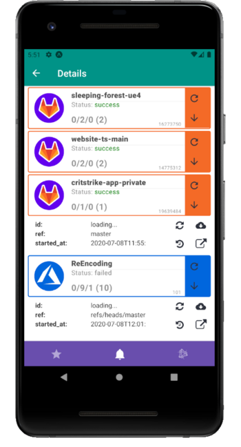
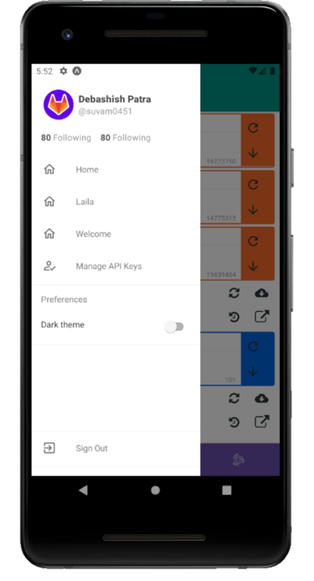
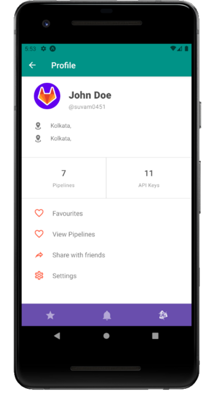

# Pipelines visualizer app

Portfolio app for android and iOS, built with React.js ⚛️ and Typescript.

| Experience       | Libraries                                       |
| :--------------- | :---------------------------------------------- |
| UI/UX            | @react-native-paper, @react-native-vector-icons |
| REST API         | Azure Devops, Gitlab                            |
| State management | @asyncstorage                                   |

## Main screen

The user would be able to **view his pipeline statuses** in a list of dashboards. The dashboards are **themed** to the services they represent.

The two buttons on the main dashboard allow the user to either refresh the screen or toggle the extended section below, exposing further information about the repository/pipelines.

## The sidebar

The sidebar links to the main screen mentioned above, and the profile screen mentioned below. It also has a **dark mode toggle** feature _(Using PaperProvider and ContextProvider)_ from `@react-native-paper` and `@react-native` respectively.

## The profile screen

The profile screen is an access point to browse to all other main screens.

## Additional information

- This project uses `@expo` for build and libraries.
- The data fetching occurs directly with `@axios`, without any client libraries.

👋
